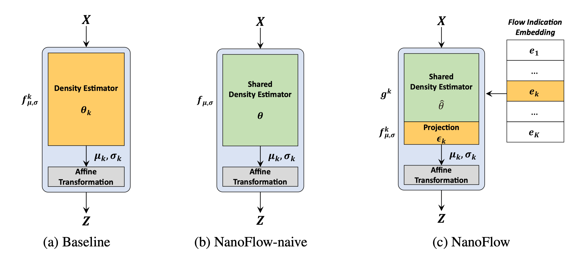

## NanoFlow: Scalable Normalizing Flows with Sublinear Parameter Complexity

#### Update: Pretrained weights are now available. See links below.

This repository is an official PyTorch implementation of the paper:
 
> Sang-gil Lee, Sungwon Kim, Sungroh Yoon. "NanoFlow: Scalable Normalizing Flows with Sublinear Parameter Complexity." _NeurIPS_ (2020).
>[[arxiv]](https://arxiv.org/abs/2006.06280)
>



A flow-based network is considered to be inefficient in parameter complexity because of reduced expressiveness of bijective mapping, which renders the models unfeasibly expensive in terms of parameters. We present an alternative parameterization scheme called NanoFlow, which uses a single neural density estimator to model multiple transformation stages.

The codebase provides two real-world applications of flow-based models with our method:

1. Waveform synthesis model (i.e. neural vocoder) based on [WaveFlow] (Ping et al., ICML 2020). See below for a detailed description.
2. Image density estimation based on [Glow] (Kingma et al., NIPS 2018), hosted in a separate `image_density_experiments` subdirectory.


## Setup

1. Clone this repo and install requirements

   ```command
   git clone https://github.com/L0SG/NanoFlow.git
   cd NanoFlow
   pip install -r requirements.txt
   ```

2. Install [Apex] for mixed-precision training


## Train your model

1. Download [LJ Speech Data]. In this example it's in `data/`

2. Make a list of the file names to use for training/testing.

   ```command
   ls data/*.wav | tail -n+1310 > train_files.txt
   ls data/*.wav | head -n1310 > test_files.txt
   ```
    `-n+1310` and `-n1310` indicates that this example reserves the first 1310 audio clips (10 % of the dataset) for model testing.

3. Edit the configuration file and train the model.

    Below are the example commands using `nanoflow-h16-r128-emb512.json`

   ```command
   nano configs/nanoflow-h16-r128-emb512.json
   python train.py -c configs/nanoflow-h16-r128-emb512.json
   ```
   Single-node multi-GPU training is automatically enabled with [DataParallel] (instead of [DistributedDataParallel] for simplicity).

   For mixed precision training, set `"fp16_run": true` on the configuration file.

   You can load the trained weights from saved checkpoints by providing the path to `checkpoint_path` variable in the config file.

   `checkpoint_path` accepts either explicit path, or the parent directory if resuming from averaged weights over multiple checkpoints.

   ### Examples
   insert `checkpoint_path: "experiments/nanoflow-h16-r128-emb512/waveflow_5000"` in the config file then run
   ```command
   python train.py -c configs/nanoflow-h16-r128-emb512.json
   ```

   for loading averaged weights over 10 recent checkpoints, insert `checkpoint_path: "experiments/nanoflow-h16-r128-emb512"` in the config file then run
   ```command
   python train.py -a 10 -c configs/nanoflow-h16-r128-emb512.json
   ```

   you can reset the optimizer and training scheduler (and keep the weights) by providing `--warm_start`
   ```command
   python train.py --warm_start -c configs/nanoflow-h16-r128-emb512.json
   ```
   
4. Synthesize waveform from the trained model.

   insert `checkpoint_path` in the config file and use `--synthesize` to `train.py`. The model generates waveform by looping over `test_files.txt`.
   ```command
   python train.py --synthesize -c configs/nanoflow-h16-r128-emb512.json
   ```
   if `fp16_run: true`, the model uses FP16 (half-precision) arithmetic for faster performance (on GPUs equipped with Tensor Cores).


### Implementation details
Here, we describe architectural details worth mentioning:

1.  We used row-wise autoregressive coupling transformation for the entire data point for each flow. This is implemented by shifting the data point down by one and padding the first upper row with zeros (see `shift_1d`). The network uses the shifted input for the transformation.
    
    For example, with `h=16`, all `16` rows are transformed, whereas the [official implementation] transforms `15` rows by splitting the input into the upper `1` and remaining `15` rows and performing transformation on `15` rows. The difference in performance is marginal. [Our other WaveFlow repo] provides more faithful details following the [official implementation].  
    
2. We used `math.sqrt(0.5)` as a constant multiplier for `fused_res_skip` similar to [other open-source implementation of WaveNet]. Later we found that the difference is negligible.

3. There exists a tiny fraction of unused network parameter (half of the last `res_skip_conv` layer) for the simplicity of implementation. 

4. We initialized `multgate` for NanoFlow with ones (`self.multgate = nn.Parameter(torch.ones(num_layer, filter_size))`) for WaveFlow-based experiments, instead of using zero-init (`self.multgate = nn.Parameter(torch.zeros((6, hidden_channels, 1, 1)))`) accompanied by `multgate = torch.exp(multgate)` from Glow-based experiments.

    Later we found no meaningful difference between the two, but the latter assures the positive value range to be interpreted as gating.

5. `reverse_fast` implements an edge case version of the [convolution queue] mechanism without a proper queue system for simplicity. It is only correct up to `"n_height": 16` with `"n_layer_per_cycle": 1`.    


### Pretrained Weights

We provide pretrained weights via Google Drive. The models are further fine-tuned for additional 2.5 M steps with a constant `"learning_rate": 2e-4` from the checkpoint used in the paper, then we averaged weights over 20 last checkpoints with `-a 20`. 

Please note that these models are **not** based on the best-performing vocoder configuration of the WaveFlow paper and serve as a comparative study. Specifically,

1. The models are trained on the 90 % of the LJSpeech clips and the remaining 10 % clips are used only for evaluation.
2. We have not applied the bipartized permutation method in these models.


| Models        | Test set LL (gain)| Params (M) | Download |
|:-------------:|:-------------:|:-------------:|:-------------:|
| waveflow-h16-r64      | 5.1499 (+0.0142) | 5.925 |[Link](https://drive.google.com/file/d/1kECsaspuoqEOHiJ2b1ZKLKJJvKRm0nRV/view?usp=sharing) |
| waveflow-h16-r128       | 5.2263 (+0.0204) | 2.792 |[Link](https://drive.google.com/file/d/1ayQMwpdmv3SJYs_0qQNf79gsy1ymSwKP/view?usp=sharing) |
| nanoflow-h16-r128-emb512      | 5.1711 (+0.0125) | 2.819 |[Link](https://drive.google.com/file/d/1zyadD7RhsUN_YLH9uDGxWRFkJAj1NeL5/view?usp=sharing)      | 
| nanoflow-h16-r128-emb1024-f16      | 5.2024 (+0.0151) | 2.845 |[Link](https://drive.google.com/file/d/10ccVfmIxLkKlrzFxY6QVkyxnMAOgAf8y/view?usp=sharing)      | 

You can load the pretrained weights by inserting the path to the `"checkpoint_path"` in the config file.
   
## Reference
NVIDIA Tacotron2: https://github.com/NVIDIA/tacotron2

NVIDIA WaveGlow: https://github.com/NVIDIA/waveglow

r9y9 wavenet-vocoder: https://github.com/r9y9/wavenet_vocoder

FloWaveNet: https://github.com/ksw0306/FloWaveNet

Parakeet: https://github.com/PaddlePaddle/Parakeet

WaveFlow (unofficial): https://github.com/L0SG/WaveFlow

Glow-PyTorch: https://github.com/y0ast/Glow-PyTorch

Neural Spline Flows (nsf): https://github.com/bayesiains/nsf

[Tacotron2]: https://github.com/NVIDIA/tacotron2
[DataParallel]: https://pytorch.org/docs/stable/generated/torch.nn.DataParallel.html
[DistributedDataParallel]: https://pytorch.og/docs/stable/generated/torch.nn.parallel.DistributedDataParallel.html
[Glow]: https://arxiv.org/abs/1807.03039
[WaveFlow]: https://arxiv.org/abs/1912.01219
[LJ Speech Data]: https://keithito.com/LJ-Speech-Dataset
[Apex]: https://github.com/nvidia/apex
[official implementation]: https://github.com/PaddlePaddle/Parakeet
[Glow-PyTorch]: https://github.com/y0ast/Glow-PyTorch
["NanoFlow: Scalable Normalizing Flows with Sublinear Parameter Complexity"]: https://arxiv.org/abs/2006.06280
[here]: https://github.com/r9y9/wavenet_vocoder/issues/67
[Our other WaveFlow repo]: https://github.com/L0SG/WaveFlow
[other open-source implementation of WaveNet]: https://github.com/r9y9/wavenet_vocoder/issues/67
[convolution queue]: https://arxiv.org/abs/1611.09482